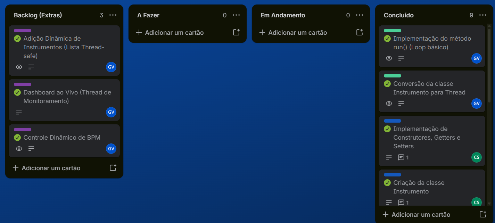

# 🎧 Mesa de DJ — Atividade em Equipe sobre Threads

Uma aplicação de console em **Java puro** que simula uma **mesa de DJ**: várias faixas musicais
(os *instrumentos*) tocam ao mesmo tempo, cada uma na sua própria **Thread**, de forma totalmente
independente.

Quem roda o projeto assume o papel do DJ: dá para tocar, pausar, acelerar e até adicionar novos
instrumentos **com o programa em execução**, sem interromper as faixas que já estão rolando ao fundo.

---

## 🚀 Como executar

Requisito: apenas um **JDK** instalado. O projeto usa somente a biblioteca padrão do Java —
sem dependências externas. (Testado com o JDK 25.)

```bash
# compilar
javac -d bin src/*.java

# executar
java -cp bin Main
```

> 💡 Use um terminal com suporte a UTF-8 e códigos ANSI (Windows Terminal, PowerShell 7,
> ou qualquer terminal Linux/macOS) para que os emojis e o *dashboard* apareçam corretamente.

---

## 🎚️ A mesa inicial

Ao subir, a aplicação já monta a mesa com **8 instrumentos** e cria uma thread para cada um:

`Violao` · `Guitarra` · `Bateria` · `Piano` · `Baixo` · `Violino` · `Sino` · `Harpa`

Todos eles começam **parados** (em `wait()`, sem consumir CPU). O show só começa quando o DJ
manda tocar — use a opção `1` para liberar os instrumentos que quiser ouvir.

---

## 🎛️ Comandos

O menu aceita tanto as **opções numéricas** quanto **comandos de texto**:

| Comando | O que faz |
|---|---|
| `1` | Toca (retoma) um instrumento — o programa pergunta o nome em seguida |
| `2` | Para (silencia) um instrumento — o programa pergunta o nome em seguida |
| `3` | Lista os instrumentos da mesa |
| `4` | Abre o dashboard ao vivo (ENTER volta ao menu) |
| `0` | Encerra o sistema |
| `add <nome>` | Cria um instrumento novo e já sobe a thread dele tocando |
| `bpm <nome> <ms>` | Muda o intervalo entre as batidas, em milissegundos (50 a 5000) |

Detalhes úteis:

- Os nomes **não diferenciam maiúsculas de minúsculas**: `bateria`, `Bateria` e `BATERIA` acham o
  mesmo instrumento.
- O `add` usa apenas a **primeira palavra** como nome, então prefira nomes sem espaços
  (`add Pandeiro`, não `add Caixa de Guerra`).
- Nomes repetidos são recusados: cada instrumento entra uma vez só na mesa.

Exemplos:

```text
add Pandeiro      → ➕ Pandeiro entrou na mesa e já está tocando.
bpm Bateria 500   → ⏩ Bateria agora bate a cada 500ms (120 BPM).
bpm Bateria 10    → ❌ Intervalo deve estar entre 50 e 5000 ms.
```

---

## 📊 Dashboard ao vivo

A opção `4` liga uma **thread de monitoramento** que redesenha a tela a cada 2 segundos com o
status de todos os instrumentos. A tela abaixo é de uma sessão com `Violao` e `Bateria` tocando,
a `Bateria` acelerada para 500ms e um `Pandeiro` adicionado em tempo de execução:

```text
=================================================
   DASHBOARD AO VIVO - MESA DE DJ
=================================================
   INSTRUMENTO    STATUS     BPM      BATIDAS
-------------------------------------------------
🎵  Violao         TOCANDO    60       42
⏸  Guitarra       PARADO     60       0
🎵  Bateria        TOCANDO    120      95
⏸  Piano          PARADO     60       0
⏸  Baixo          PARADO     60       0
⏸  Violino        PARADO     60       0
⏸  Sino           PARADO     60       0
⏸  Harpa          PARADO     60       0
🎵  Pandeiro       TOCANDO    60       18
=================================================
   Instrumentos: 9   |   atualiza a cada 2s
=================================================
Pressione ENTER para voltar ao menu.
```

O contador de **BATIDAS** continua subindo enquanto o dashboard está aberto: é a prova de que as
threads dos instrumentos seguem rodando em paralelo, independentes da thread que desenha a tela.

---

## 🧠 Conceitos de concorrência aplicados

O projeto foi construído para exercitar, na prática, os principais pontos de programação concorrente:

| Conceito | Onde aparece |
|---|---|
| `Runnable` + `Thread` | `Instrumento` e `Dashboard` implementam `Runnable`; cada instrumento roda em sua própria thread |
| `wait()` / `notify()` | Pausar e retomar um instrumento — a thread dorme sem consumir CPU (*busy waiting* zero) |
| `synchronized` | Protege a lista compartilhada em `MesaDeSom` e o estado interno de cada instrumento |
| `volatile` | Campos lidos por uma thread e escritos por outra (`pausado`, `batidas`, `intervaloMs`, `ativo`) |
| Cópia defensiva | `MesaDeSom.listar()` devolve uma cópia da lista, evitando `ConcurrentModificationException` |
| `interrupt()` | Encerramento limpo das threads ao sair ou ao parar o dashboard |
| Thread *daemon* | O dashboard não segura o programa aberto depois que a `Main` termina |

---

## 🗂️ Estrutura do projeto

```text
threadsIF/
├── src/
│   ├── Main.java         → menu do console, interpreta os comandos do DJ
│   ├── MesaDeSom.java    → lista compartilhada de instrumentos (acesso sincronizado)
│   ├── Instrumento.java  → a faixa musical: uma thread com play/pause/BPM
│   └── Dashboard.java    → thread de monitoramento que imprime o status ao vivo
├── docs/                 → imagens usadas na documentação
└── bin/                  → arquivos .class gerados na compilação (fora do versionamento)
```

---

## 👥 Membros da Equipe

| Integrante | GitHub |
|---|---|
| Andrews Queiroz | [@4ndrewss](https://github.com/4ndrewss) |
| Caio Gilles | [@CaioGilles](https://github.com/CaioGilles) |
| Enzo Amorim | [@ENZOBRS](https://github.com/ENZOBRS) |
| Gabriela Bayo | [@gabibayo](https://github.com/gabibayo) |
| Glauco Santos| [@glaucosantos002](https://github.com/glaucosantos002) |
| Gustavo Veloso | [@velosogustavo](https://github.com/velosogustavo) |


---

## 📌 Gestão e Organização

O acompanhamento das etapas de construção da mesa de DJ, a divisão técnica da equipe e o backlog
do projeto foram gerenciados via Trello.

📋 **Acesso ao Quadro:** [Acessar Trello da Equipe](https://trello.com/b/BraYUbmZ/infra-threads)


